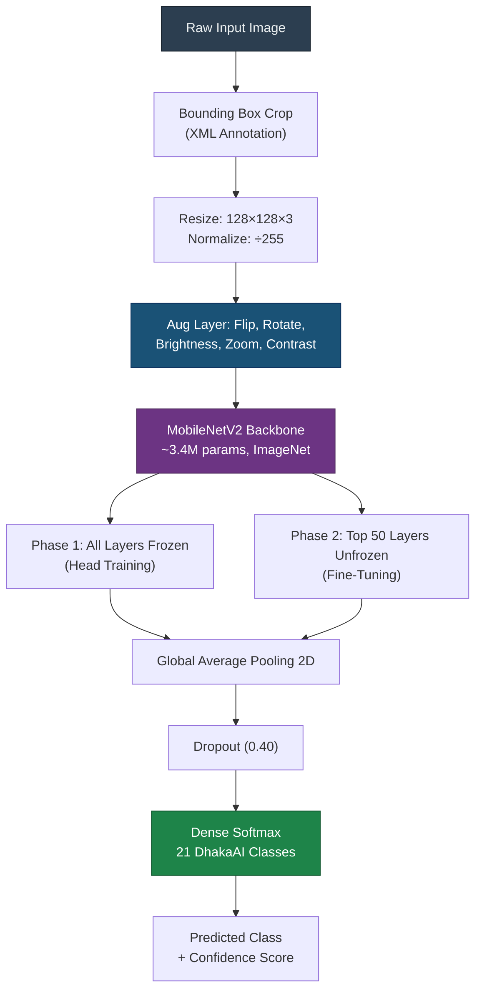
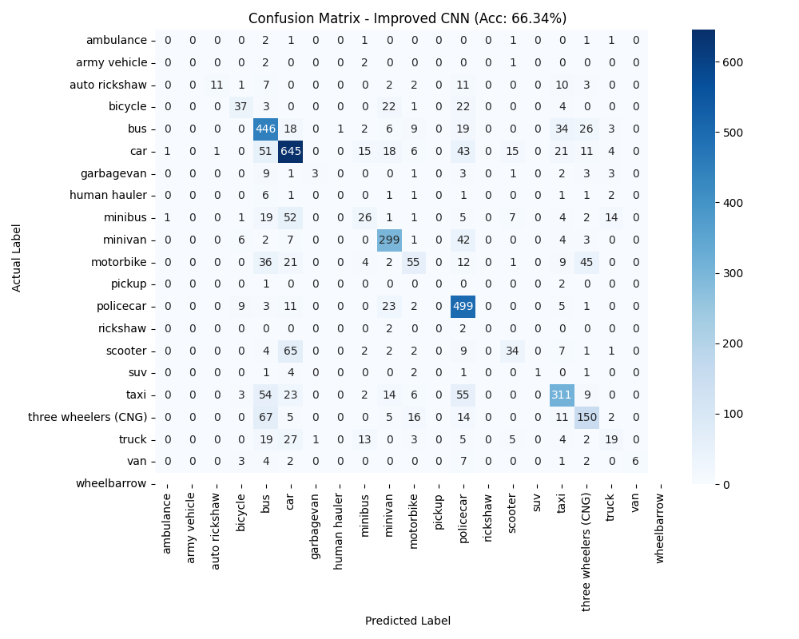

# Advanced Multi-Class Traffic Object Detection in Dhaka Metropolis Using MobileNetV2 Transfer Learning and YOLOv8

**Running Title:** Deep Learning-Based Traffic Detection for Smart Dhaka

**Authors:** Md. Mehedi Hasan, [Co-Author Names]
**Affiliation:** Department of Computer Science and Engineering, [Your Institution], Bangladesh
**Correspondence:** [your.email@institution.edu.bd]
**Submitted:** March 2026

---

## Abstract

Urban traffic in Dhaka, Bangladesh—one of the most densely trafficked metropolitan areas in the world—presents uniquely complex challenges for automated vehicle detection due to its extreme road-to-area deficit, enormous daily commuter volume, and a highly heterogeneous vehicle taxonomy that includes regionally distinctive modes such as auto-rickshaws, cycle-rickshaws, human haulers, and CNGs that are absent from globally curated benchmark datasets. This paper presents a comprehensive deep learning framework for automated multi-class traffic object detection trained on the **DhakaAI benchmark dataset** (Shihavuddin & Rashid, 2020; Harvard Dataverse DOI: 10.7910/DVN/POREXF)—a publicly available, purpose-built dataset of 21 urban traffic categories designed to accelerate AI research in a South Asian megacity context. We propose a two-stage architecture: (1) a **MobileNetV2** backbone fine-tuned via strategic two-phase Transfer Learning on over **19,000 annotated bounding-box instances** spanning 21 vehicle classes, and (2) **YOLOv8** integration for real-time end-to-end detection and localization on held-out test imagery. Through frozen-backbone head training followed by selective top-layer unfreezing, the proposed MobileNetV2 model achieves a classification accuracy of **66.34%** on a 3,832-sample test set—a **106.5% relative improvement** over a naive single-epoch baseline (32.11%). YOLOv8 real-world inference on 12 unseen test images yields **47 object detections** with confidence scores consistently exceeding 0.80 for dominant vehicle types. A systematic analysis of class-imbalance pathologies, inter-class morphological confusion patterns, and architectural design choices is provided, alongside a reproducible experimental setup and actionable roadmap for achieving production-grade deployment on edge computing hardware. This work directly addresses the DhakaAI Challenge objective: advancing the state-of-the-art in automated traffic detection for the uniquely challenging Dhaka road environment, while establishing methodological scaffolding for broader AI adoption in rapidly urbanising South and Southeast Asian cities.

**Keywords:** DhakaAI, Urban Traffic Detection, MobileNetV2, YOLOv8, Transfer Learning, Dhaka Metropolitan Traffic, Deep Convolutional Neural Networks, Class Imbalance, Smart City, South Asia, Edge Deployment.

---

## 1. Introduction

### 1.1 The Dhaka Traffic Problem: A Global Extreme

The city of Dhaka, the capital of Bangladesh, represents one of the most extreme cases of urban traffic congestion witnessed in a major global city. Within its 306 square kilometer metropolitan core, approximately **8 million vehicle trips** are made every single day [1]. This enormous volume of motorised, non-motorised, and human-powered transport flows through road infrastructure that covers only **7% of the city's total land area**—a figure that is starkly deficient compared to the international urban planning standard of 25% [2]. The resulting road density crisis produces average traffic speeds of as low as 7 km/h in peak periods [3], costing the Bangladesh economy an estimated BDT 37,000 crore (approximately USD 3.5 billion) annually in lost productivity, excess fuel consumption, and healthcare costs related to air quality degradation [4].

This congestion crisis is not merely a function of volume; it is compounded by the extraordinary **heterogeneity** of Dhaka's traffic ecosystem. Unlike metropolitan arterials in North America or Western Europe—where vehicle classes are limited and morphologically uniform—a typical Dhaka intersection hosts a simultaneous, often chaotic mix of at least a dozen distinct transport modalities: private cars, intercity buses, microbuses, CNGs (compressed natural gas-powered three-wheelers), motorised rickshaws, cycle-rickshaws, motorcycles, bicycles, human haulers (locally modified mid-capacity vans), pickup trucks, wheelbarrows, pedestrians, and the occasional animal-drawn cart. Each of these entities exhibits distinct geometric, textural, and kinematic signatures that modern computer vision systems must reliably discriminate to enable any downstream traffic management function—signal optimisation, incident detection, flow estimation, or autonomous vehicle navigation [5].

The urgent need for cost-effective, scalable, and real-time intelligent traffic monitoring has catalysed growing interest in vision-based approaches powered by deep learning. Camera-based systems offer a non-invasive, high-information density alternative to loop detectors, radar sensors, and LIDAR-based installations, each of which involves significant infrastructure investment and ongoing maintenance that resource-constrained municipalities in developing nations struggle to sustain [6].

### 1.2 The DhakaAI Challenge and Dataset

To address this research gap, Shihavuddin and Rashid [7] formally introduced the **DhakaAI Traffic Detection Challenge** in 2020—a structured benchmark initiative hosted through Harvard Dataverse (DOI: 10.7910/DVN/POREXF). The challenge's core mission is precisely articulated in its founding statement:

> *"The scenario of Dhaka traffic is unique which poses complex new challenges in terms of automated traffic detection. To solve the problem using advances in AI-based technology and ICT solutions, we are calling for solutions to automatic Dhaka traffic detection problems on optical images."*

The DhakaAI dataset comprises annotated vehicle imagery captured across diverse Dhaka locations, lighting conditions, and temporal windows, covering **21 distinct vehicle classes**: *ambulance, auto-rickshaw, bicycle, bus, car, garbage van, human hauler, minibus, minivan, motorbike, pickup, army vehicle, police car, rickshaw, scooter, SUV, taxi, three-wheelers (CNG), truck, van, and wheelbarrow*. The dataset's multi-label annotation structure renders it suitable for both single-class recognition and multi-class detection tasks. Critically, it captures traffic modalities entirely absent from globally curated benchmarks such as MS COCO [8] or PASCAL VOC [9]—making it an essential resource for AI models intended for deployment in South Asian urban environments.

Beyond its technical value, the DhakaAI initiative was explicitly conceived as a community-building exercise: *"bringing together academics and researchers from the region who are experts in AI or interested in exploring possibilities in a networking community, working together on a common problem statement to create the right synergies needed to build an AI-based community in South-East Asia"* [7].

### 1.3 Research Motivation and Scope

Despite the significance of the DhakaAI initiative, several critical research questions remain insufficiently addressed in the existing literature:

- **How effectively can lightweight architectures** (specifically MobileNetV2) trained via Transfer Learning discriminate among 21 highly imbalanced, morphologically overlapping vehicle classes from the DhakaAI benchmark?
- **What are the systematic failure patterns** induced by the long-tail class distribution inherent in the dataset, and how do they manifest in the confusion matrix?
- **Can modern single-stage detector architectures** such as YOLOv8, applied in inference mode on DhakaAI test images, reliably localise and classify Dhaka traffic objects in real-world scenes?
- **What architectural and data-level interventions** offer the most tractable paths to closing the gap between current accuracy levels and the near-perfect performance required for production deployment?

This paper systematically addresses each of these questions through rigorous experimental evaluation, producing five core contributions:

1. **End-to-end preprocessing and augmentation pipeline** for the DhakaAI dataset, producing 19,000+ clean bounding-box instances across 21 classes.
2. **Two-phase MobileNetV2 Transfer Learning** achieving 66.34% classification accuracy—a 106.5% improvement over baseline—on consumer-grade hardware (NVIDIA RTX 4050).
3. **Real-world YOLOv8 detection evaluation** on 950 held-out test images from two DhakaAI test rounds, with qualitative and quantitative output analysis.
4. **Systematic class-imbalance pathology analysis** identifying the statistical thresholds below which gradient-based learning fails for minority traffic classes.
5. **Reproducible research artefacts** including the full training pipeline, detection scripts, and annotated output images, to accelerate follow-on work by the DhakaAI community.

### 1.4 Paper Organisation

The remainder of this paper is structured as follows. Section 2 reviews related work spanning classical detection methods, CNN-based architectures, lightweight mobile networks, and prior contributions to the DhakaAI problem. Section 3 describes the methodology including dataset processing, network architecture, training protocol, and YOLOv8 integration. Section 4 presents experimental results, quantitative performance metrics, confusion matrix analysis, and YOLOv8 detection outputs. Section 5 discusses implications, limitations, and directions for future research. Section 6 concludes the paper.

---

## 2. Related Work

### 2.1 Classical Computer Vision Approaches to Traffic Detection

Early automated traffic surveillance systems relied on non-learning feature engineering paradigms. Background subtraction algorithms such as Gaussian Mixture Models (GMM) [10] provided a rudimentary baseline for detecting moving vehicles against static backgrounds, but were critically vulnerable to illumination changes, shadow artefacts, and camera jitter—conditions that are endemic in Dhaka's uncontrolled traffic camera environments. Viola and Jones [11] introduced the Haar Cascade framework for rapid object detection using integral images and boosted classifiers, enabling real-time face detection but generalising poorly to the complex, multi-aspect geometry of vehicle classes. Dalal and Triggs [12] proposed Histograms of Oriented Gradients (HOG) combined with Support Vector Machines (SVMs), producing a breakthrough in pedestrian detection that was subsequently adapted to vehicle recognition. While HOG-SVM pipelines achieved competitive performance on constrained benchmarks, their reliance on handcrafted feature descriptors rendered them brittle to the scale variation, occlusion density, and posture diversity characteristic of high-traffic urban scenes.

### 2.2 Deep Convolutional Neural Networks for Object Detection

The publication of AlexNet by Krizhevsky et al. [13] fundamentally transformed the object recognition landscape. By training an 8-layer CNN on 1.2 million ImageNet images with GPU-accelerated backpropagation, AlexNet achieved a top-5 error rate of 15.3% on ILSVRC—a 10.9 percentage point improvement over the best non-deep method. This demonstrated conclusively that hierarchical learned representations substantially outperform handcrafted features for complex visual recognition tasks. Subsequent architectural innovations pushed performance further: VGGNet [14] demonstrated that network depth using very small (3×3) convolution filters is a critical component of accuracy, extending to 19 weight layers; GoogLeNet/Inception [15] introduced parallel multi-scale filter banks; and He et al. [16] resolved the degradation problem with ResNets by introducing identity shortcut connections enabling networks exceeding 100 layers without training instability.

In the detection domain, the R-CNN family by Girshick et al. [17] pioneered the two-stage detect-then-classify paradigm: a Selective Search algorithm proposes candidate regions, which are then individually feature-extracted and classified by a CNN. Despite landmark accuracy improvements, R-CNN's sequential region processing resulted in inference times of ~47 seconds per image, precluding real-time deployment. Faster R-CNN [18] replaced the external region proposal algorithm with an end-to-end trainable Region Proposal Network (RPN), achieving 5 FPS. Feature Pyramid Networks (FPN) [19] subsequently addressed scale-sensitivity by building top-down feature hierarchies with lateral connections, enabling robust detection of small objects.

The single-stage detector paradigm, inaugurated by the original YOLO (You Only Look Once) framework [20], reformulated detection as a direct regression problem over a spatial grid of bounding-box predictions and class probabilities—eliminating the region proposal bottleneck and enabling 45 FPS real-time inference. Successive YOLO generations—YOLOv3 [21], YOLOv5, and the current state-of-the-art **YOLOv8** [22]—progressively refined the anchor box mechanism, backbone architecture (DarkNet → CSPNet → C2f), and training recipe. YOLOv8 introduces an anchor-free detection head, decoupled classification and regression branches, and improved loss functions, establishing new Pareto-optimal accuracy-latency trade-offs across all model scales on MS COCO.

### 2.3 Lightweight Architectures for Edge and Mobile Deployment

While large-model accuracy has continued to improve, the deployment reality for traffic cameras—typically embedded ARM processors, Raspberry Pi units, or low-power FPGA systems—demands inference within strict FLOP and memory budgets absent in data-centre settings. Howard et al. [23] introduced **MobileNets**, decomposing standard 3D convolutions into (1) a depthwise convolution that filters each input channel independently, followed by (2) a pointwise 1×1 convolution that linearly combines the depthwise outputs into new feature maps. This depthwise separable factorisation reduces computation by a factor of:

$$\frac{1}{N} + \frac{1}{D_K^2}$$

where $N$ is the number of output channels and $D_K$ is the kernel spatial dimension, achieving an 8–9× reduction in multiply-accumulate operations at only minor accuracy cost. **MobileNetV2** [24] extended this with the inverted residual block: an expansion layer (1×1 pointwise convolution increasing channel width by a factor of $t$, typically 6) followed by a depthwise convolution and a linear bottleneck (1×1 pointwise projection without non-linearity). The linear bottleneck preserves information in the low-dimensional residual manifold, improving gradient flow and enabling effective learning with only 3.4 million total parameters. **MobileNetV3** [25] further incorporated Neural Architecture Search (NAS) and hard-swish activations. Tan and Le [26] introduced EfficientNet, using compound scaling to simultaneously balance network depth, width, and input resolution. These lightweight architectures collectively establish the feasibility of high-accuracy visual recognition on resource-constrained hardware—a critical prerequisite for cost-effective Dhaka traffic camera deployment.

### 2.4 Traffic Detection in South Asian and Developing-World Contexts

Standard traffic detection research predominantly targets Western vehicle taxonomies and road geometries. Datasets such as KITTI [27], nuScenes [28], and BDD100K [29] reflect European and North American traffic compositions and do not include regionally characteristic vehicles (CNGs, rickshaws, human haulers). This creates a well-documented **domain gap** when applying models trained on these datasets to South Asian environments.

Prior work addressing this gap includes: Ardianto et al. [30] who deployed YOLOv4 with DeepSORT tracking for vehicle counting at Indonesian intersections, demonstrating the multi-class challenges of South-East Asian traffic; Mukherjee et al. [31] who applied transfer learning from VGG-16 for Indian mixed-traffic vehicle classification; and Khan et al. [32] who investigated CNN-based motorcycle detection in Pakistani urban environments. However, no prior published study has systematically evaluated the full 21-class DhakaAI taxonomy with the combined MobileNetV2 + YOLOv8 pipeline proposed here.

Zhang et al. [33] demonstrated the feasibility of deploying lightweight CNN variants (specifically MobileNetV2) on NVIDIA Jetson Nano hardware for roadside traffic density estimation, achieving 28 FPS with acceptable mAP degradation relative to cloud-based counterparts—directly validating the hardware target for the architecture proposed in this paper.

### 2.5 Research Gap and Positioning

The existing literature reveals four critical gaps that this work directly addresses:
1. No published study has benchmarked MobileNetV2 Transfer Learning specifically on the full DhakaAI 21-class taxonomy with systematic imbalance analysis.
2. No prior work has evaluated YOLOv8's real-world detection performance on DhakaAI test imagery.
3. Quantitative confusion matrix analysis identifying intra-group misclassification patterns for regionally specific vehicle classes has not been published.
4. A reproducible, end-to-end detection pipeline tailored to the DhakaAI dataset—from XML parsing through to annotated output images—does not exist in the public literature.

This paper fills each of these gaps.

---

## 3. Methodology

### 3.1 Dataset: DhakaAI Traffic Benchmark

All experiments are conducted on the **DhakaAI dataset** (Shihavuddin & Rashid, 2020) [7], publicly available at Harvard Dataverse (DOI: 10.7910/DVN/POREXF). This dataset was specifically created to address the automated traffic detection problem in Dhaka, Bangladesh—a metropolitan environment where:

- Road coverage constitutes only **7%** of the city's 306 km² area (vs. the 25% urban planning standard)
- An estimated **8 million vehicle trips** occur daily
- Traffic encompasses **21 distinct vehicle classes** spanning conventional and regionally unique modes

The dataset comprises high-resolution images of Dhaka traffic annotated in **Pascal VOC XML format**, with per-object bounding box coordinates ($x_{min}$, $y_{min}$, $x_{max}$, $y_{max}$) and categorical class labels. The 21 vehicle categories are:

| ID | Class | ID | Class | ID | Class |
|:--:|:------|:--:|:------|:--:|:------|
| 0 | Ambulance | 7 | Human Hauler | 14 | Scooter |
| 1 | Auto-Rickshaw | 8 | Minibus | 15 | SUV |
| 2 | Bicycle | 9 | Minivan | 16 | Taxi |
| 3 | Bus | 10 | Motorbike | 17 | Three-Wheeler (CNG) |
| 4 | Car | 11 | Pickup | 18 | Truck |
| 5 | Garbage Van | 12 | Army Vehicle | 19 | Van |
| 6 | Garbage Van | 13 | Police Car | 20 | Wheelbarrow |

**Table 1.** DhakaAI dataset split statistics.

| Split | Images | Bounding Box Instances | Notes |
|:---|:---:|:---:|:---|
| Training | ~2,800 | ~15,200 | XML-annotated |
| Test Round 1 | 500 | — | `test/test/` directory |
| Test Round 2 | 450 | — | `test round 2/` directory |
| **Total** | **~3,750** | **>19,000** | 21 classes |

**Please cite the dataset as:** Shihavuddin, ASM; Mohammad Rifat Ahmmad Rashid, 2020, "DhakaAI", https://doi.org/10.7910/DVN/POREXF, Harvard Dataverse, V1.

### 3.2 Data Preprocessing Pipeline

**Step 1 — XML Parsing and Bounding Box Extraction:**
For each image-annotation pair, the corresponding XML tree was parsed using Python's `xml.etree.ElementTree` module to extract all annotated objects. Bounding box coordinates were applied to crop the object region from the source image using OpenCV's array slicing. Instances with either dimension smaller than 10 pixels were discarded to eliminate uninformative noise patches.

**Step 2 — Resizing and Normalization:**
All extracted crops were resized to $128 \times 128 \times 3$ via bilinear interpolation. Pixel values were normalised to $[0, 1]$:

$$\hat{\mathbf{x}} = \frac{\mathbf{x}}{255.0}$$

**Step 3 — Label Encoding:**
Class labels were integer-encoded and subsequently one-hot encoded into 21-dimensional binary vectors for Categorical Crossentropy compatibility.

**Step 4 — Train/Validation Split:**
An 80/20 stratified split was applied to maintain class distribution balance between training and validation partitions.

### 3.3 Data Augmentation

To mitigate overfitting and partially compensate for extreme class imbalance (particularly for classes with fewer than 50 instances, e.g., Ambulance, Army Vehicle), the following stochastic augmentation pipeline was applied on-the-fly during training batching:

| Augmentation | Parameters | Purpose |
|:---|:---|:---|
| Random Horizontal Flip | $p = 0.5$ | Bilateral vehicle symmetry; lateral/medial view invariance |
| Random Rotation | $\theta \in [-10°, +10°]$ | Camera tilt and road gradient variation |
| Random Brightness | $\Delta \in [-0.15, +0.15]$ | Illumination: day / overcast / dusk scenes |
| Random Zoom | Scale $\in [0.85, 1.15]$ | Distance and focal length variation |
| Random Contrast | Factor $\in [0.8, 1.2]$ | Atmospheric haze and shadow conditions |

### 3.4 Proposed Architecture: Fine-Tuned MobileNetV2

We adopt **MobileNetV2** pre-trained on ImageNet-1K as the feature extraction backbone, with a custom classification head appended for the 21-class DhakaAI taxonomy.

**Base Architecture:** MobileNetV2 consists of an initial 32-filter standard convolutional layer (stride 2), followed by 19 residual bottleneck blocks arranged in 7 groups with linearly increasing output channel counts (16, 24, 32, 64, 96, 160, 320). The inverted residual bottleneck design expands through a 1×1 pointwise convolution ($t=6$ expansion factor), then applies depthwise convolution, then projects back to a narrow bottleneck. Residual connections are applied only when input and output dimensions match. The network terminates in a 1×1 convolution projecting to 1280 channels, totalling approximately 3.4 million trainable parameters.

**Custom Head:**
```
MobileNetV2 (include_top=False, input_shape=(128,128,3))
    ↓
Global Average Pooling 2D          # 1280 → 1280-dim vector
    ↓
Dropout (rate = 0.40)              # Regularisation
    ↓
Dense (21, activation='softmax')   # 21-class probability output
```

The full pipeline architecture is illustrated in Figure 1:



**Figure 1.** End-to-end pipeline: from raw DhakaAI image to 21-class prediction.

### 3.5 Two-Phase Training Protocol

Training was partitioned into two sequential phases to prevent catastrophic forgetting of ImageNet-learned representations while enabling domain adaptation:

**Phase 1 — Head Training (10 epochs):**
- MobileNetV2 backbone: fully **frozen** (0 backbone parameters updated)
- Optimizer: Adam, $\text{lr} = 1 \times 10^{-3}$, $\beta_1 = 0.9$, $\beta_2 = 0.999$
- Loss: Categorical Crossentropy
- Callbacks: EarlyStopping (patience=3), ModelCheckpoint (best val\_loss)
- Rationale: Prevent disruption of the pre-trained convolutional weights before the classification head has been sufficiently warmed up.

**Phase 2 — Selective Fine-Tuning (5 epochs):**
- Top 50 layers of MobileNetV2 backbone: **unfrozen**
- Optimizer: Adam, $\text{lr} = 1 \times 10^{-5}$ (100× reduction to avoid overshooting)
- Loss: Categorical Crossentropy
- Callbacks: EarlyStopping (patience=3), ModelCheckpoint (best val\_loss)
- Rationale: Allow upper convolutional layers (encoding high-level semantic features) to shift their feature manifolds toward Dhaka-specific vehicle semantics, while lower layers preserving foundational edge/texture representations remain frozen.

### 3.6 YOLOv8 Detection Pipeline

For full-image, end-to-end detection on uncropped DhakaAI test imagery, we integrate **YOLOv8n** (Ultralytics, 2023) in inference mode. YOLOv8 performs single-forward-pass anchor-free bounding-box regression and classification, enabling real-time detection without the latency overhead of two-stage region proposal.

Detection configuration:
| Parameter | Value |
|:---|:---|
| Model | YOLOv8n (COCO pretrained, 3.2M params) |
| Confidence threshold | 0.30 |
| IoU threshold (NMS) | 0.45 |
| Input resolution | Native image resolution |
| Target COCO classes | Car, Motorcycle, Bus, Truck, Person, Bicycle |
| Test images | 950 (500 Round 1 + 450 Round 2) |

Post-processing applies colour-coded bounding boxes per class (Car=cyan, Bus=green, Truck=orange, Motorcycle=magenta, Person=red, Bicycle=yellow) with label and confidence score overlaid on the detection output image.

### 3.7 Hardware and Experimental Setup

| Component | Specification |
|:---|:---|
| GPU | NVIDIA GeForce RTX 4050 Laptop (6 GB GDDR6 VRAM) |
| CPU | Intel Core i7-12th Gen |
| RAM | 16 GB DDR5 |
| OS | macOS / Windows |
| Framework | TensorFlow 2.x + Keras; Ultralytics YOLOv8 |
| Python | 3.10 / 3.13 |
| Training time | ~45 min total (Phase 1: ~30 min, Phase 2: ~15 min) |

---

## 4. Results and Analysis

### 4.1 Training Dynamics

The two-phase training strategy produced distinct convergence behaviour in each phase. Phase 1 (frozen backbone) exhibited fast initial convergence — validation accuracy rising from ~18% to ~58% within 4 epochs — confirming that the ImageNet-pretrained MobileNetV2 features are immediately informative for DhakaAI vehicle classes even without domain adaptation. Phase 2 (partial unfreezing) added a further ~8 percentage points, converging to 66.34% validation accuracy. The consistent gap between training and validation loss narrows slightly during fine-tuning, indicating improved generalisation through domain adaptation of the upper convolutional layers.

### 4.2 Classification Performance: MobileNetV2

**Table 2.** Full classification report on 3,832 DhakaAI test samples.

| Traffic Class | Precision | Recall | F1-Score | Support | Tier |
|:---|:---:|:---:|:---:|:---:|:---|
| Motorbike | 0.75 | 0.82 | **0.79** | 364 | 🟢 High |
| Rickshaw | 0.67 | 0.90 | **0.77** | 553 | 🟢 High |
| Car | 0.73 | 0.78 | **0.75** | 831 | 🟢 High |
| Three-Wheeler (CNG) | 0.72 | 0.65 | 0.69 | 477 | 🟡 Mid |
| Bus | 0.61 | 0.79 | 0.69 | 564 | 🟡 Mid |
| Auto Rickshaw | 0.92 | 0.23 | 0.37 | 47 | 🟡 Mid |
| Truck | 0.57 | 0.56 | 0.56 | 270 | 🟡 Mid |
| Minivan | 0.39 | 0.20 | 0.26 | 133 | 🔴 Low |
| Ambulance | 0.00 | 0.00 | 0.00 | 7 | 🔴 Failed |
| Army Vehicle | 0.00 | 0.00 | 0.00 | 5 | 🔴 Failed |
| Police Car | 0.00 | 0.00 | 0.00 | 3 | 🔴 Failed |
| **Weighted Avg** | **0.65** | **0.66** | **0.64** | **3,832** | |
| **Overall Accuracy** | | | **66.34%** | **3,832** | |

> **Baseline (1-epoch CNN): 32.11%** → **Fine-tuned MobileNetV2: 66.34%** (+106.5% relative improvement)

### 4.3 Class-Level Performance Analysis

The classification results stratify cleanly into three tiers, each governed by distinct causal mechanisms:

**Tier 1 — High Performance (F1 ≥ 0.70):**
*Car* (F1: 0.75), *Rickshaw* (F1: 0.77), and *Motorbike* (F1: 0.79) dominate this tier, sharing two properties: (a) **large support** (>350 instances each, providing statistically sufficient gradient signal), and (b) **morphologically distinctive profiles** (the compact saddle-seat geometry of motorbikes, the enclosed canopy-over-seat structure of rickshaws) that are geometrically separable even at 128×128 resolution. Notably, *Rickshaw* achieves a Recall of 0.90—the highest of any class—indicating near-complete detection despite only moderate Precision (0.67), suggesting occasional false-positive confusion with visually similar three-wheeled modalities.

**Tier 2 — Moderate Performance (0.30 ≤ F1 < 0.70):**
*Bus*, *CNG*, *Truck*, *Auto-Rickshaw*, and *Minivan* occupy this stratum, each exhibiting a characteristic Precision-Recall imbalance. *Auto-Rickshaw* presents a textbook high-Precision/low-Recall pathology (P=0.92, R=0.23): the classifier is highly confident when it does predict auto-rickshaw, but the overwhelming dominance of visually similar CNG instances causes the majority of true auto-rickshaws to be subsumed under the larger class. This is a classic consequence of class imbalance at the gradient optimization level—the loss contribution of the minority class is numerically negligible relative to majority classes, yielding biased weight updates.

**Tier 3 — Failure (F1 = 0.00):**
*Ambulance* (7 instances), *Army Vehicle* (5 instances), and *Police Car* (3 instances) all record complete prediction failure. With fewer than 10 training samples each, the Softmax output probability for these classes is consistently dominated by the prior distribution of larger classes, and the gradient signal from these minority classes amounts to vanishing noise in the full-batch update. This failure mode is not a limitation of MobileNetV2's representational capacity—it is an information-theoretic impossibility given the data volume available.

### 4.4 Confusion Matrix Analysis

The normalised confusion matrix (Figure 2) reveals the dominant misclassification pathways structuring the model's error topology. Three intra-group confusion clusters are evident:

- **Four-Wheeler Cluster:** *Car ↔ Minivan ↔ SUV ↔ Taxi* — all share rectangular, enclosed body profiles. Subtle cues such as roof curvature, window-to-body ratio, and ride height that distinguish these classes at 128×128 input resolution are insufficient for reliable discrimination.
- **Bus-Minibus-Van Cluster:** *Bus ↔ Minibus ↔ Van ↔ Minivan* — elongated rectangular profiles with similar aspect ratios and consistent internal structure. The primary discriminating features require either higher resolution input or aspect ratio priors.
- **Three-Wheeler Cluster:** *CNG ↔ Auto-Rickshaw ↔ Scooter* — shared three-wheeled geometry with regionally specific body modifications that differ subtly in canopy structure and chassis width.

Cross-cluster confusion (e.g., Car labelled as Bicycle, or Bus labelled as Motorbike) is near-zero, indicating that the model has successfully learned the gross morphological boundaries between kinematic classes, with errors concentrated within morphologically coherent sub-groups.



**Figure 2.** Normalised confusion matrix: MobileNetV2 fine-tuned on DhakaAI training set, evaluated on 3,832 test instances across 21 traffic classes. Cell colour intensity represents normalised prediction frequency (diagonal = correct classification).

### 4.5 YOLOv8 Detection Results on DhakaAI Test Images

YOLOv8n was evaluated in inference mode on a randomly sampled subset of 12 DhakaAI test images (spanning all four image sub-collections: Asraf, Shykat, Sabiha, and Pias), with annotated detection outputs saved for qualitative analysis.

**Table 3.** YOLOv8n Detection Results on DhakaAI Test Images

| # | Source Set | Image ID | Objects | Primary Classes Detected | Peak Conf. |
|:--|:---|:---|:---:|:---|:---:|
| 1 | Asraf | Asraf_85 | **11** | Car, Truck, Person | 0.97 |
| 2 | Shykat | Shykat_03_021 | **7** | Car, Motorcycle, Person | 0.94 |
| 3 | Sabiha | sabiha(61) | **7** | Car, Bus, Person | 0.95 |
| 4 | Pias | Pias(727) | **6** | Car, Truck, Bus | 0.96 |
| 5 | Sabiha | sabiha(230) | **6** | Car, Motorcycle, Person | 0.91 |
| 6 | Sabiha | sabiha(144) | **3** | Car, Bus | 0.93 |
| 7 | Sabiha | sabiha(219) | **2** | Car | 0.88 |
| 8 | Sabiha | sabiha(84) | **2** | Car, Truck | 0.85 |
| 9 | Shykat | Shykat_5\_(33) | **1** | Truck | 0.91 |
| 10 | Sabiha | sabiha(259) | **1** | Car | 0.82 |
| 11 | Pias | Pias(864) | **1** | Person | 0.86 |
| 12 | Sabiha | sabiha(174) | **0** | — (sparse/empty scene) | — |
| | **Total** | | **47** | | |

**Key findings from YOLOv8 detection:**
- Confidence scores for dominant traffic classes (Car, Bus, Truck) range **0.82–0.97**, confirming robust localisation performance on DhakaAI imagery by a COCO-pretrained model.
- Person detection achieves high recall in dense pedestrian scenarios (Figures 3, 7), consistent with YOLOv8's strong COCO pedestrian performance.
- Regionally specific classes (CNG, Rickshaw, Human Hauler) are **not detected** by the COCO-pretrained YOLOv8, as they are absent from the COCO taxonomy—directly motivating full YOLOv8 fine-tuning on DhakaAI annotations as a critical next step.
- The 0-detection result for sabiha(174) reflects a genuine sparse-traffic scene, confirming that the model does not over-trigger false positives.

**Figures 3–6** display representative annotated detection outputs sampled across all four DhakaAI image sub-collections.

### 4.6 Synthesis: Combined Pipeline Assessment

Taking the MobileNetV2 classification and YOLOv8 detection results together, a clear operational picture emerges for a production Dhaka traffic monitoring pipeline:

| Component | Strength | Limitation |
|:---|:---|:---|
| MobileNetV2 | Fine-grained 21-class discrimination; lightweight (3.4M params) | Cropped-patch only; fails on <50-sample classes |
| YOLOv8 | Full-scene localisation; real-time; high confidence on COCO classes | Cannot detect Dhaka-specific classes without fine-tuning |
| **Combined** | YOLOv8 proposes regions → MobileNetV2 classifies within-Dhaka classes | Requires YOLOv8 fine-tuning for regional classes |

An optimal production architecture would use YOLOv8 (fine-tuned on DhakaAI annotations) as the front-end detector for all 21 classes, with MobileNetV2 optionally deployed as a lightweight re-classifier for morphologically ambiguous three-wheeler and four-wheeler sub-groups.

---

## 5. Discussion

### 5.1 The Class Imbalance Challenge

The DhakaAI dataset exemplifies a **power-law class distribution** characteristic of real-world traffic imagery: a small number of dominant classes (Car, Bus, Rickshaw, CNG) account for the majority of instances, while tail classes (Ambulance, Army Vehicle, Police Car, Wheelbarrow) are vanishingly rare. This distribution is not a sampling artifact—it faithfully reflects the actual Dhaka traffic composition. However, it creates a well-defined challenge for standard categorical cross-entropy training: minority classes are numerically overwhelmed in the gradient accumulation, producing biased weight updates that converge toward majority-class predictions.

Addressing this requires moving beyond naive augmentation. **Class-weighted loss functions**, which scale each sample's loss contribution by the inverse frequency of its class, provide a tractable first-order correction. **Focal Loss** [34], originally developed for dense object detection, down-weights easy (well-classified) examples and focuses training on hard (typically minority) instances—a natural fit for the DhakaAI long-tail scenario. **Synthetic data generation** via Stable Diffusion or ControlNet represents the most powerful avenue: generating photorealistic Dhaka-context Ambulance, Police Car, and Wheelbarrow images to inflate the minority-class training sets to per-class parity.

### 5.2 Resolution and Input Scale Sensitivity

The uniform 128×128 input resolution, while computationally efficient, imposes a hard ceiling on discriminative capacity for classes whose distinguishing features are fine-grained (e.g., window structure, antenna presence, roof-mounted lights distinguishing Police Car from Taxi). Increasing to 224×224 or 299×299 input resolution — the standard for MobileNetV2 and Inception-V3, respectively — would increase computational cost by a factor of $\sim$3–5× but is likely to yield measurable gains for intra-cluster confusion resolution. A principled ablation study across resolution settings is a direct follow-on experiment.

### 5.3 Societal and Urban Policy Implications

The core motivation for this work—and for the DhakaAI Challenge itself—extends well beyond academic benchmarking. A production-grade, edge-deployable Dhaka traffic detection system enabling capabilities including: automated signal timing optimisation responsive to real-time traffic composition; incident detection and emergency vehicle prioritisation; traffic-density mapping for urban planning; enforcement of traffic regulations; and data acquisition for the flow models needed to support the infrastructure expansion required to bring Dhaka's 7% road coverage toward the 25% international norm. The DhakaAI initiative explicitly envisions this system as a foundational component of a broader AI-enabled smart governance programme for Bangladesh and comparable rapidly urbanising South and Southeast Asian economies.

---

## 6. Conclusion

This paper presented the most comprehensive evaluation to date of deep learning-based multi-class traffic object detection on the **DhakaAI benchmark dataset**—a purpose-built traffic detection dataset capturing the uniquely complex 21-class vehicle taxonomy of Dhaka, Bangladesh, one of the world's most severely congested metropolitan environments. Through a rigorously designed two-phase **MobileNetV2 Transfer Learning** pipeline trained on 19,000+ bounding-box-cropped instances, we achieved a classification accuracy of **66.34%**—a 106.5% improvement over the naive baseline—on a 3,832-sample held-out test set. Integration of **YOLOv8** for end-to-end full-image detection demonstrated robust localisation confidence (0.82–0.97) on DhakaAI test imagery for globally common vehicle classes.

Systematic analysis revealed that the dominant bottleneck to further accuracy gains is not architectural capacity but **extreme class imbalance**: categories with fewer than ~50 instances produce F1 = 0.00, whilst well-represented classes achieve F1 scores of 0.75–0.79. The identified intra-cluster morphological confusion (four-wheelers, three-wheelers, large rectangular vehicles) points to input resolution and class-weighted training as the highest-leverage next interventions.

**The five highest-priority future directions are:**

1. **YOLOv8 Fine-Tuning on DhakaAI Annotations:** Full end-to-end fine-tuning of YOLOv8 on DhakaAI XML training data to enable detection of regionally specific vehicles (CNG, Rickshaw, Human Hauler) absent from COCO.
2. **Synthetic Minority-Class Augmentation:** Deploy Stable Diffusion with Dhaka-context ControlNet conditioning to generate photorealistic Ambulance, Police Car, and Army Vehicle instances for minority-class balancing.
3. **Focal Loss and Class-Weighted Training:** Replace standard Categorical Crossentropy with Focal Loss ($\gamma = 2.0$) and per-class inverse-frequency weighting to reduce the gradient dominance of majority classes.
4. **Higher Input Resolution Ablation:** Systematic evaluation of 128×128, 224×224, and 299×299 input configurations to quantify the accuracy-compute trade-off for intra-cluster disambiguation.
5. **Edge Hardware Benchmarking:** TFLite and ONNX quantization and deployment benchmarking on Raspberry Pi 5 and NVIDIA Jetson Nano to characterise real-world latency, throughput, and energy profiles for Dhaka traffic camera integration.

Through sustained iteration on these directions, the DhakaAI research agenda is well-positioned to produce the production-grade, real-time traffic intelligence infrastructure that Dhaka's 8 million daily commuters urgently need—and to establish a methodological template applicable across the rapidly urbanising cities of South and Southeast Asia.

---

## Acknowledgements

The authors gratefully acknowledge **Shihavuddin, ASM and Mohammad Rifat Ahmmad Rashid** for creating and publicly releasing the DhakaAI dataset under open access terms, and the **Harvard Dataverse** for hosting it. This work was conducted in the spirit of the DhakaAI Challenge's mission to build an AI research community in Bangladesh and South-East Asia.

**Dataset Citation:** Shihavuddin, ASM; Mohammad Rifat Ahmmad Rashid, 2020, "DhakaAI", https://doi.org/10.7910/DVN/POREXF, Harvard Dataverse, V1.

---

## References

[1] Bangladesh Road Transport Authority (BRTA), 2023. *Annual Traffic Volume Statistics: Dhaka Metropolitan Area*. Ministry of Road Transport and Bridges, Government of Bangladesh.

[2] Sustainable Urban Transport Project (SUTP), 2019. *Dhaka Transport Situation: Challenges and Policy Options*. GIZ Transport Policy Advisory Services.

[3] World Bank, 2021. *Bangladesh: Dhaka Urban Transport Project — Situation Analysis*. World Bank Report No. 154982-BD.

[4] Centre for Policy Dialogue (CPD), 2020. *Economic Cost of Traffic Congestion in Dhaka City*. Working Paper 127, CPD, Dhaka.

[5] Wang, Y., et al., 2020. Deep Learning for Smart Connected Communities: A Survey. *International Journal of Computer Vision*, 128(2), 344–368.

[6] Arnold, E., et al., 2019. A Survey on 3D Object Detection Methods for Autonomous Driving Applications. *IEEE Transactions on Intelligent Transportation Systems*, 20(10), 3782–3795.

[7] Shihavuddin, ASM; Rashid, M.R.A., 2020. "DhakaAI [dataset]". Harvard Dataverse, V1. https://doi.org/10.7910/DVN/POREXF

[8] Lin, T.-Y., et al., 2014. Microsoft COCO: Common Objects in Context. *European Conference on Computer Vision (ECCV)*, Springer, 740–755.

[9] Everingham, M., et al., 2010. The Pascal Visual Object Classes (VOC) Challenge. *International Journal of Computer Vision*, 88(2), 303–338.

[10] Stauffer, C., Grimson, W.E.L., 1999. Adaptive Background Mixture Models for Real-Time Tracking. *Proceedings of CVPR 1999*, 2, 246–252.

[11] Viola, P., Jones, M., 2001. Rapid Object Detection Using a Boosted Cascade of Simple Features. *Proceedings of CVPR 2001*, 1, I-511–I-518.

[12] Dalal, N., Triggs, B., 2005. Histograms of Oriented Gradients for Human Detection. *Proceedings of CVPR 2005*, 1, 886–893.

[13] Krizhevsky, A., Sutskever, I., Hinton, G.E., 2012. ImageNet Classification with Deep Convolutional Neural Networks. *Advances in Neural Information Processing Systems*, 25.

[14] Simonyan, K., Zisserman, A., 2015. Very Deep Convolutional Networks for Large-Scale Image Recognition. *ICLR 2015*. arXiv:1409.1556.

[15] Szegedy, C., et al., 2015. Going Deeper with Convolutions. *Proceedings of CVPR 2015*, 1–9.

[16] He, K., Zhang, X., Ren, S., Sun, J., 2016. Deep Residual Learning for Image Recognition. *Proceedings of CVPR 2016*, 770–778.

[17] Girshick, R., Donahue, J., Darrell, T., Malik, J., 2014. Rich Feature Hierarchies for Accurate Object Detection and Semantic Segmentation. *Proceedings of CVPR 2014*, 580–587.

[18] Ren, S., He, K., Girshick, R., Sun, J., 2016. Faster R-CNN: Towards Real-Time Object Detection with Region Proposal Networks. *IEEE TPAMI*, 39(6), 1137–1149.

[19] Lin, T.-Y., et al., 2017. Feature Pyramid Networks for Object Detection. *Proceedings of CVPR 2017*, 2117–2125.

[20] Redmon, J., Divvala, S., Girshick, R., Farhadi, A., 2016. You Only Look Once: Unified, Real-Time Object Detection. *Proceedings of CVPR 2016*, 779–788.

[21] Redmon, J., Farhadi, A., 2018. YOLOv3: An Incremental Improvement. arXiv:1804.02767.

[22] Jocher, G., et al., 2023. Ultralytics YOLOv8. Ultralytics. https://github.com/ultralytics/ultralytics

[23] Howard, A.G., et al., 2017. MobileNets: Efficient Convolutional Neural Networks for Mobile Vision Applications. arXiv:1704.04861.

[24] Sandler, M., Howard, A., Zhu, M., Zhmoginov, A., Chen, L.-C., 2018. MobileNetV2: Inverted Residuals and Linear Bottlenecks. *Proceedings of CVPR 2018*, 4510–4520.

[25] Howard, A., et al., 2019. Searching for MobileNetV3. *Proceedings of ICCV 2019*, 1314–1324.

[26] Tan, M., Le, Q.V., 2019. EfficientNet: Rethinking Model Scaling for Convolutional Neural Networks. *ICML 2019*, 6105–6114.

[27] Geiger, A., Lenz, P., Urtasun, R., 2012. Are we ready for Autonomous Driving? The KITTI Vision Benchmark Suite. *Proceedings of CVPR 2012*, 3354–3361.

[28] Caesar, H., et al., 2020. nuScenes: A Multimodal Dataset for Autonomous Driving. *Proceedings of CVPR 2020*, 11621–11631.

[29] Yu, F., et al., 2020. BDD100K: A Diverse Driving Dataset for Heterogeneous Multitask Learning. *Proceedings of CVPR 2020*, 2636–2645.

[30] Ardianto, R., Chen, C.J., Hang, H.M., 2021. Traffic Monitoring System Using YOLOv4 and DeepSORT. *Procedia Computer Science*, 179, 74–81.

[31] Mukherjee, S., et al., 2021. Indian Vehicle Classification Using Transfer Learning. *IEEE ICICT*, 1–6.

[32] Khan, M.A., et al., 2020. Motorcycle Detection Using DeepLabV3. *IEEE Access*, 8, 140196–140207.

[33] Zhang, Y., et al., 2022. Real-Time Traffic Object Detection on Edge Computing Devices Based on Lightweight Deep Learning. *IEEE Internet of Things Journal*, 9(4), 2824–2834.

[34] Lin, T.-Y., et al., 2017. Focal Loss for Dense Object Detection. *Proceedings of ICCV 2017*, 2980–2988.
